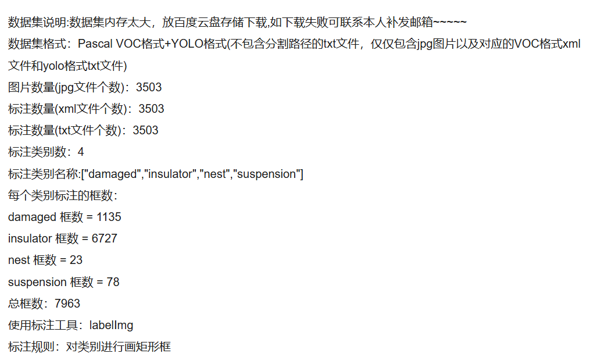
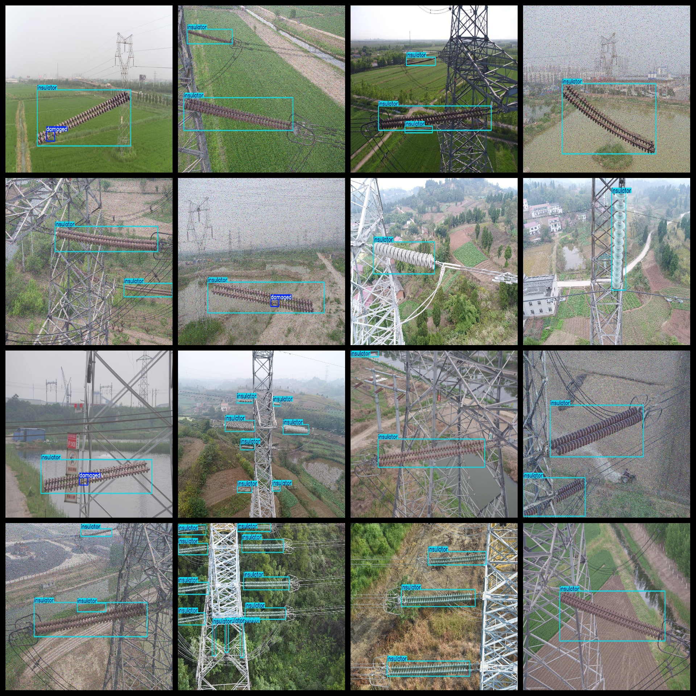
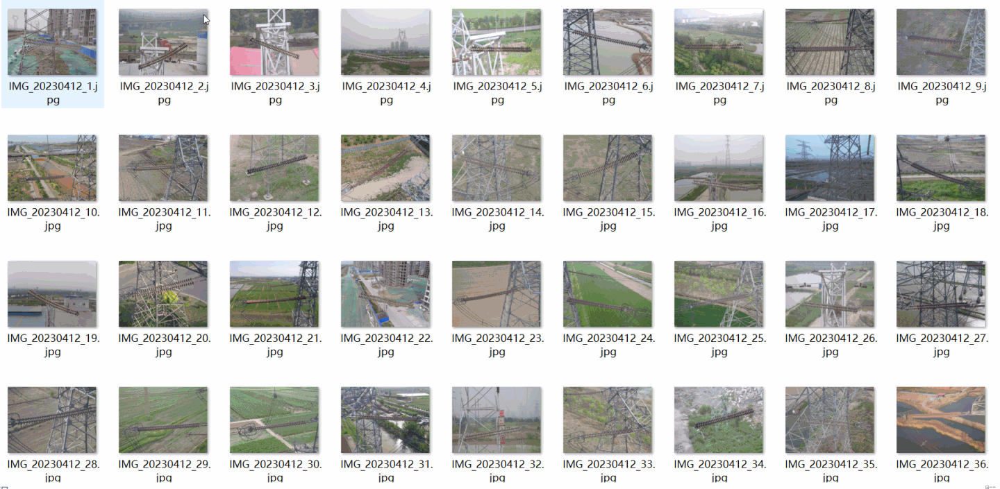

# [Object Detection] Insulator Damage Defect Detection Dataset 3500 imagesYOLO+VOC format

Dataset Description: ~

Dataset format: Pascal VOC format + YOLO format (the txt file does not contain the split path, it only contains jpg images and corresponding VOC format xml files and yolo format txt files)

Number of images (number of jpg files): 3503

Number of annotations (number of xml files): 3503

Number of annotations (number of txt files): 3503

Number of annotated categories: 4

Annotation class names: ["damaged","insulator","nest","suspension"]

Number of boxes labeled in each category:

damaged frame count = 1135

insulator frame count = 6727

nest frame count = 23

suspension frame count = 78

Total boxes: 7963

Use the labeling tool: labelImg

Rules for annotation: Draw a rectangle around the category.

## Images

---

Here is a pay link on Stripe (https://buy.stripe.com/3cs8yP7sY87d0vu9AB). Please contact me lonlonago@foxmail.com after funding $89, and I will send you a complete data files, thank you!

